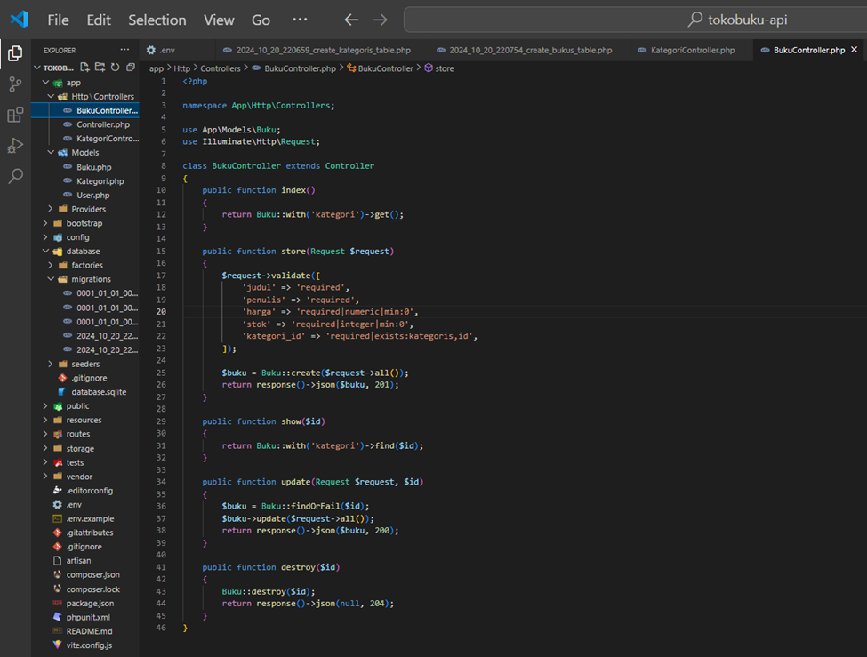

Praktikum
Persiapan

1. Instalasi Laravel 11:
   
   
   

2. Konfigurasi Database
   
   

3. Migrasi Awal
   

Membuat API CRUD untuk Sistem Toko Buku
API ini akan mengelola data buku dan kategori dengan beberapa endpoint:

1. Kategori: Menambahkan dan menampilkan kategori buku.
2. Buku: Mengelola informasi buku (judul, penulis, harga, stok, dan kategori).

3. Membuat Migration dan Model
   Membuat migration dan model untuk Kategori dan Buku:
   

Edit file migration `create_kategoris_table.php`:

Edit file migration `create_bukus_table.php`:

2. Membuat Controller API untuk Kategori dan Buku
   

Isi file `KategoriController.php`:

Isi file `BukuController.php`:

3. Menambahkan Route API
   

Testing API dengan Postman

1.  Jalankan Server Laravel:
    

2.  Testing endpoint menggunakan Postman:
    A. GET Semua Kategori
    • Method: GET
    • URL: http://localhost:8000/api/kategoris
    • Klik Send untuk melihat hasil.
    

        B. POST Tambah Kategori Baru
        • Method: POST
        • URL: http://localhost:8000/api/kategoris
        • Body :
      

        GET Semua Buku
        • Method: GET
        • URL: http://localhost:8000/api/bukus
        • Klik Send.
      

        POST Tambah Buku Baru
      

        GET Buku Berdasarkan ID
        • Method: GET
        • URL: http://localhost:8000/api/bukus/1
        • Klik Send.
      

        PUT Update Data Buku
      

        DELETE Hapus Buku
         • Method: DELETE
         • URL: http://localhost:8000/api/bukus/1
         • Klik Send.
      